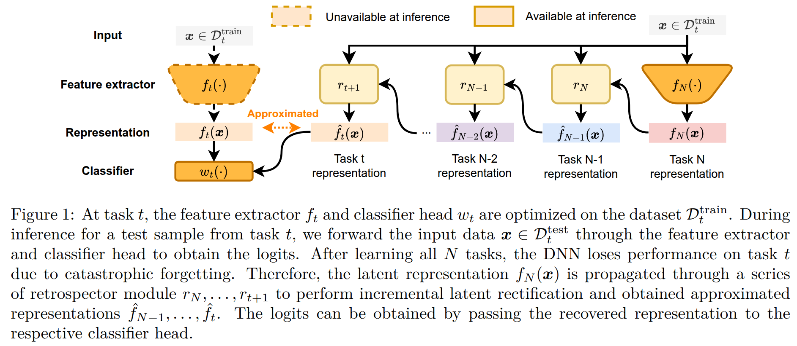

# Retrospective Feature Estimation for Continual Learning

[](LICENSE)
[](https://openreview.net/forum?id=9NnhVME4Q6)

Official repository for "Retrospective Feature Estimation for Continual Learning" (TMLR 2026, Featured Certification).

## Abstract

The intrinsic capability to continuously learn a changing data stream is a desideratum of deep neural networks (DNNs). However, current DNNs suffer from catastrophic forgetting, which interferes with remembering past knowledge. To mitigate this issue, existing Continual Learning (CL) approaches often retain exemplars for replay, regularize learning, or allocate dedicated capacity for new tasks. This paper investigates an unexplored direction for CL called Retrospective Feature Estimation (RFE). RFE learns to reverse feature changes by aligning the features from the current trained DNN backward to the feature space of the old task, where performing predictions is easier. This retrospective process utilizes a chain of small feature mapping networks called retrospector modules. Empirical experiments on several CL benchmarks, including CIFAR10, CIFAR100, and Tiny ImageNet, demonstrate the effectiveness and potential of this novel CL direction compared to existing representative CL methods, motivating further research into retrospective mechanisms as a principled alternative for mitigating catastrophic forgetting in CL.



## Usage

### Structure

We aim to provide a simple and extensible implementation for continual learning pipelines. The codebase is strongly type-annotated with both static (`mypy`, `ty`) and runtime type checking (`beartype`). All tensor shapes are strictly annotated to avoid ambiguity. Methods are lazily imported, so any changes in one method do not affect the others (see `run.py`).

### Dependency

The project uses [`uv`](https://docs.astral.sh/uv/) to manage dependencies. To use the locked dependencies, run `uv sync`. The Python version used is 3.11.14.

### Datasets

All datasets are automatically downloaded.

### CLI

The general syntax is: `python run.py [DATASET AND TRAINING ARGS] [model_name] [MODEL ARGS]`. For example, to run experience replay (ER) with CIFAR10, use `python run.py --dataset cifar10 er --buffer-size 500`.

To see all the available options, use: `python run.py --help` or `python run.py [model_name] --help`.

Examples:

```bash
python run.py --dataset cifar100-5s rfe --regularize-weight 1.0 # RFE
python run.py --dataset cifar100-5s rfe-data --buffer-size 500 --regularize-weight 1.0 --only-last-task # RFE-P
python run.py --dataset cifar100-5s rfe-data --buffer-size 500 --regularize-weight 1.0 --no-only-last-task # RFE-B
```

For quick development, you can also add the flag `--toy` to run on a subset of the data.

## License

The project is released under the Apache License 2.0. See [LICENSE](LICENSE) for more details.

## Citation

If you use the code in this repo in your research, please consider citing our paper:

```bibtex
@article{nguyenRetrospectiveFeatureEstimation2026,
 title = {Retrospective Feature Estimation for Continual Learning},
 author = {Nguyen, Nghia D. and Nguyen, Hieu Trung and Li, Ang and Pham, Hoang and Nguyen, Viet Anh and Doan, Khoa D.},
 year = 2026,
 journal = {Transactions on Machine Learning Research},
 url = {https://openreview.net/forum?id=9NnhVME4Q6},
}
```

## Credit

This repository was developed with reference to and inspiration from the following works:

- Mammoth: <https://github.com/aimagelab/mammoth>
- CLS-ER: <https://github.com/NeurAI-Lab/CLS-ER>
- TAMiL: <https://github.com/NeurAI-Lab/TAMiL>
